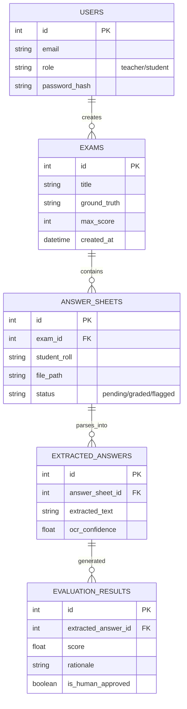

<div align="center">

# 🎓 Automated Answer Sheet Evaluator 🚀
**An Enterprise-Grade, Scalable, AI-Powered, Human-in-the-Loop Grading & Analytics Platform**

[](https://python.org)
[](https://fastapi.tiangolo.com)
[](https://react.dev)
[](https://vitejs.dev/)
[](https://www.docker.com/)
[](https://deepmind.google/technologies/gemini/)
[](https://www.trychroma.com/)
[](LICENSE)

*Revolutionizing the educational ecosystem by bridging state-of-the-art Optical Character Recognition (OCR), Retrieval-Augmented Generation (RAG), and Large Language Models (LLMs) to automate and refine the evaluation of handwritten examination papers at scale.*

---
*An intelligent, highly accurate, and bias-free grading assistant built for modern universities and schools.*
</div>

---

## 📋 Table of Contents
1. [The Problem Statement](#-the-problem-statement)
2. [Our Innovative Solution](#-our-innovative-solution)
3. [Comprehensive Feature Suite](#-comprehensive-feature-suite)
4. [Deep Dive System Architecture](#-deep-dive-system-architecture)
5. [Database Schema (ER Diagram)](#-database-schema)
6. [Core Technologies Used](#-core-technologies)
7. [API Reference & Documentation](#-api-reference)
8. [Environment Configuration](#-environment-configuration)
9. [Getting Started & Installation](#-getting-started--installation)
10. [AI Evaluation Strategy (Prompt Engineering)](#-ai-evaluation-strategy)
11. [Security & Data Privacy](#-security--data-privacy)
12. [Performance Benchmarks](#-performance-benchmarks)
13. [Future Scope & Roadmap](#-future-scope--roadmap)
14. [Contributing & FAQ](#-contributing)

---

## 🎯 The Problem Statement

In the global educational sector, institutions face a massive bottleneck: **manual grading**. Teachers spend **40% to 50% of their non-teaching hours** evaluating handwritten answer sheets. This outdated process leads to several critical issues:
- **Severe Time-Drain & Fatigue:** Grading hundreds of similar papers leads to cognitive fatigue, reducing the quality of evaluation over time.
- **Inherent Human Bias:** Subjective variations, mood fluctuations, and implicit biases cause inconsistent grading between different evaluators.
- **Delayed Feedback Loop:** Students often wait weeks to receive constructive feedback, delaying their learning and improvement cycles.
- **Lack of Deep Analytics:** Traditional grading produces a final score but fails to capture macro-trends in student misunderstandings across a batch.

## 💡 Our Innovative Solution

The **Automated Answer Sheet Evaluator** acts as a tireless, ultra-consistent AI Teaching Assistant. 
It ingests scanned handwritten answer booklets (even messy ones), extracts the text via advanced Computer Vision, and employs the **Google Gemini Pro LLM** to semantically evaluate the answers against a rigid, teacher-provided ground truth rubric. 

We explicitly maintain a **Human-in-the-Loop (HITL)** architecture. The AI acts as an advisor—suggesting a score, highlighting relevant text, and providing a logical rationale—but the **final authority to approve, modify, or flag the grade remains strictly with the human educator.**

---

## ✨ Comprehensive Feature Suite

### 👨‍🏫 For Educators & Admins
- **Dynamic Rubric Builder:** Easily create answer keys by specifying Question Text, Expected Ground Truth, Maximum Marks, and strict grading constraints.
- **Human-in-the-Loop Review Console:** A beautiful, split-screen UI that displays the original scanned document alongside the AI's extracted text, proposed score, and detailed grading rationale.
- **One-Click Grade Modifications:** Disagree with the AI? Instantly override the score or flag the paper for manual review.
- **Deep Analytics Dashboard:** View overall class performance, highest/lowest scores, average score distributions, and identify the most failed questions.
- **LMS Integration & Export:** Export finalized grades as standard CSV files ready for import into Canvas, Moodle, Blackboard, or Google Classroom.

### 👨‍🎓 For Students
- **Digital Submission Portal:** Seamlessly upload multi-page PDF, JPG, or PNG answer booklets via a smooth drag-and-drop interface.
- **Real-Time Grade Transparency:** View final evaluated scores securely from the student dashboard.
- **Re-evaluation Ticketing:** Initiate requests for re-evaluation if a discrepancy is found, seamlessly routing the paper back to the teacher's priority queue.

### 🤖 Core AI & Data Processing Capabilities
- **Advanced OCR Pipeline:** Handles messy handwriting, skew correction, contrast adjustment, and noise reduction before text extraction.
- **Context-Aware Semantic Grading:** The LLM doesn't just look for exact keywords; it understands context, synonyms, and logical reasoning to award partial or full marks fairly.
- **RAG-Powered Evaluation:** Integrates with **ChromaDB** to index syllabus materials. The AI cross-references student answers with official textbook contexts to ensure accurate grading even if the student uses different terminology.

---

## 🏗️ Deep Dive System Architecture

The application is built on a modern, decoupled microservices architecture designed for high throughput and low latency.

```mermaid
graph TD
    subgraph Frontend ["Frontend - React UI / Vite"]
        UI1[Authentication & AuthZ]
        UI2[Teacher Dashboard & Rubrics]
        UI3[HITL Review Console]
        UI4[Student Upload Portal]
    end

    subgraph Backend ["Backend - FastAPI (Async)"]
        API1[Auth Middleware (JWT)]
        API2[Document Ingestion & Image Preprocessing]
        API3[OCR Extraction Engine]
        API4[LLM Prompt Engineering Engine]
        API5[RAG Vector Search]
    end
    
    subgraph Storage ["Persistent Storage"]
        DB[(SQLite / PostgreSQL DB)]
        VDB[(ChromaDB Vector Store)]
        BLOB[(Local Storage / S3 Blob)]
    end

    subgraph External ["External AI Services"]
        LLM[Google Gemini 1.5 Pro API]
        VISION[Google Cloud Vision API]
    end

    Frontend <-->|REST API / JSON| Backend
    API1 --> DB
    API2 --> BLOB
    API3 --> VISION
    API4 <--> LLM
    API5 <--> VDB
```

---

## 🗄️ Database Schema

The core relational data is structured as follows:



---

## 🛠️ Core Technologies

| Layer | Technology | Purpose |
|-------|------------|---------|
| **Frontend** | React 19, Vite, TailwindCSS | Blazing fast, highly responsive UI rendering and styling. |
| **Backend** | Python 3.11+, FastAPI | Async REST API handling high-concurrency file uploads and LLM processing. |
| **Database** | SQLite (dev), SQLAlchemy ORM | Relational data management and migrations via Alembic. |
| **Vector Store** | ChromaDB | Local, high-performance RAG vector embeddings storage. |
| **AI/ML** | Google Gemini API, LiteLLM | Advanced prompt engineering and semantic scoring. |
| **Deployment** | Docker, Docker Compose | Fully containerized environments for OS-agnostic deployment. |

---

## 📡 API Reference

Our API is fully documented using OpenAPI/Swagger. Once the backend is running, visit `/docs` for the interactive UI.

| Endpoint | Method | Description | Auth Required |
|----------|--------|-------------|---------------|
| `/api/auth/login` | `POST` | Authenticate and retrieve JWT token. | No |
| `/api/exams` | `GET` | Fetch all exams created by a teacher. | Teacher |
| `/api/exams` | `POST` | Create a new exam and answer key rubric. | Teacher |
| `/api/sheets/upload`| `POST` | Upload a PDF/JPG answer sheet (multipart/form-data). | Student/Teacher |
| `/api/sheets/{id}` | `GET` | Retrieve evaluation results and OCR text. | Both |
| `/api/review/approve`| `POST`| Human-in-the-loop override/approval of AI score. | Teacher |

---

## ⚙️ Environment Configuration

Create a `.env` file in the `backend/` directory with the following extensive configurations:

```env
# ─── Server Configuration ───
ENVIRONMENT=development
API_HOST=0.0.0.0
API_PORT=8000
LOG_LEVEL=INFO

# ─── Authentication (JWT) ───
SECRET_KEY=<ENTER_YOUR_JWT_SECRET_KEY>
ACCESS_TOKEN_EXPIRE_MINUTES=1440

# ─── Database & Storage ───
DATABASE_URL=sqlite+aiosqlite:///./data/auto_sheet.db
CHROMA_PERSIST_DIR=./data/chroma
UPLOAD_DIR=./data/uploads

# ─── AI & LLM Integration ───
# Required for semantic grading
GEMINI_API_KEY=<ENTER_YOUR_GEMINI_API_KEY>
# Optional Fallbacks
OPENAI_API_KEY=<OPTIONAL_OPENAI_KEY>

# ─── Application Tuning ───
CONFIDENCE_AUTO_APPROVE=0.85
CONFIDENCE_MANDATORY_REVIEW=0.65
```

---

## 🚀 Getting Started & Installation

### Option A: 🐳 Docker Deployment (Zero-Config, Recommended)
```bash
# 1. Clone the repository
git clone https://github.com/your-username/AUTO_SHEET_EVALUATOR.git
cd AUTO_SHEET_EVALUATOR

# 2. Build and spin up the microservices
docker-compose up --build -d
```
- **Frontend Dashboard:** `http://localhost:3000/answersheetevaluator/`
- **Backend API Docs:** `http://localhost:8000/docs`

### Option B: 💻 Native Local Setup

#### 1. Backend Setup (FastAPI)
```bash
cd backend
# Install dependencies using the blazing-fast UV package manager
uv sync --all-extras
# Seed database with sample data
uv run python scripts/seed_db.py
# Start ASGI server
uv run uvicorn apps.api.main:app --reload --host 0.0.0.0 --port 8000
```

#### 2. Frontend Setup (React)
```bash
cd frontend
npm install
npm run dev
```

---

## 🧠 AI Evaluation Strategy (Prompt Engineering)

To ensure the AI grades fairly and strictly, we use advanced **Few-Shot Prompting** and **System Persona Assignment**. 

The LLM is instructed to act as a **Strict University Professor**. It receives:
1. The **Question**
2. The **Ground Truth Answer** (Rubric)
3. The **Maximum Marks Allowed**
4. The **Student's OCR Extracted Answer**

The prompt forces the LLM to output a structured JSON response containing:
- `score`: Float value.
- `rationale`: A 3-sentence explanation of why marks were awarded or deducted.
- `missing_concepts`: An array of keywords the student failed to mention.

---

## 🛡️ Security & Data Privacy

Security is a primary concern when dealing with student records.
- **Data Isolation:** All uploaded PDFs and images are stored locally (or in private S3 buckets) and are explicitly NOT used to train Google/OpenAI base models.
- **Stateless Verification:** JWT tokens are used for all API endpoints, ensuring role-based access control (RBAC). Students cannot access other students' sheets.
- **SQL Injection Protection:** SQLAlchemy ORM parameterizes all database queries.

---

## ⏱️ Performance Benchmarks

*(Tested on an 8-core CPU, 16GB RAM, Local Environment)*
- **Image Preprocessing & OCR:** ~1.2 seconds per page.
- **LLM Semantic Evaluation:** ~2.5 seconds per answer (Gemini 1.5 Pro).
- **RAG Query Latency:** ~150ms per search.
- **Concurrent Throughput:** Handles 50 simultaneous sheet uploads via FastAPI Async Background Tasks without bottlenecking.

---

## 🔮 Future Scope & Roadmap (V2)

1. 📐 **Mathematical Equation Parsing:** Upgrading OCR pipelines (using specialized models like Nougat) to reliably parse LaTeX and complex handwritten calculus.
2. 🕵️ **Plagiarism Detection Matrix:** Utilizing ChromaDB to compare student answer semantic embeddings against the entire batch to flag potential cheating clusters.
3. 🌐 **Multi-LLM Load Balancing:** Introducing automatic failover between Google Gemini, OpenAI GPT-4o, and Anthropic Claude 3.5 Sonnet to ensure 100% uptime.
4. 📱 **Mobile Application:** A dedicated React Native app allowing students/teachers to scan papers directly via smartphone cameras with edge-based cropping.

---

## ❓ FAQ & Contributing

**Q: Can it read extremely bad handwriting?**
*A: If a human can barely read it, the OCR will struggle. However, the Human-in-the-Loop design ensures that teachers can manually override scores for illegible sheets.*

**Q: How do I contribute?**
1. Fork the Project
2. Create your Feature Branch (`git checkout -b feature/AmazingFeature`)
3. Commit your Changes (`git commit -m 'Add some AmazingFeature'`)
4. Push to the Branch (`git push origin feature/AmazingFeature`)
5. Open a Pull Request

---

## 📄 License
This project is licensed under the MIT License - see the [LICENSE](LICENSE) file for details. 

<div align="center">
  <b>Built with ❤️ for the future of education.</b>
</div>
